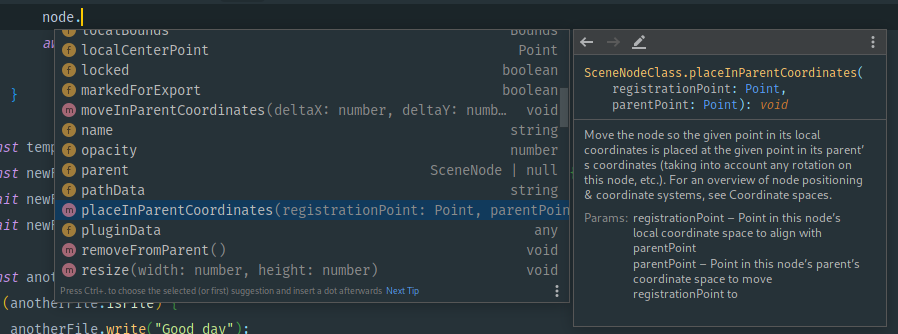

# Adobe XD Plugin API typings
Typings for [Adobe XD](https://www.adobe.io/xd/uxp/develop/reference/xd-index/) and (UXP)[https://www.adobe.io/xd/uxp/uxp/] Plugin Development 



## Getting started
These Type Declaration files provide your IDE (e.g. Visual Studio Code or WebStorm) with information about the XD API surface, enabling type checking, autocomplete suggestions, and more. 

To get started
- install the package via npm: 
  ```
  npm i @adobexd/typings`
  ```
- add the typings file to `"typeRoots"` your `jsconfig.json` or `tsconfig.json`:
  ```json
  {
    "compilerOptions": {
      "typeRoots": ["node_modules/@adobexd/typings"]
    },
  }
  ```
- (optional) add the [UXP WebComponents](https://www.adobe.io/xd/uxp/uxp/reference-spectrum/) to the `JSX.IntrinsicElements` namespace by adding a reference to a `types.d.ts` file
  ```ts
  /// <reference path="./node_modules/@adobexd/typings/uxp/jsxWebComponents.d.ts" />
  ```
  

## About these type files
These type declarations track the contents of the official documentation. If an issue with the type declarations stems from an issue with the official documentation, then the type declaration files will be fixed once the issue is addressed in the documentation. This is intentional so as to keep the type declarations both maintainable and in sync with the documentation.

A few notable exceptions include:
- The [`application.import()`](https://www.adobe.io/xd/uxp/develop/reference/application/#import) function cannot be declared because `import` is a reserved TypeScript keyword (not sure if this can be fixed). It is declared as `application.importFiles()` instead.
- To avoid ambiguity with the *DOM* `Selection` type, the interface [`Selection`](https://www.adobe.io/xd/uxp/develop/reference/selection/) is also provided as an alias `XDSelection` and exported from the `'scenegraph'` module

## Original Documentation Links
- [New Adobe.io XD Docs](https://www.adobe.io/xd/uxp/develop/reference/xd-index/)
- [New Adobe.io XD Docs GitHub Repo](https://github.com/AdobeDocs/uxp-xd/tree/main/src/pages/develop/reference)
- [Adobe XD API Updates and Changelog](https://www.adobe.io/xd/uxp/develop/changelog/)
- [Original Adobe XD Platform Docs](https://adobexdplatform.com/plugin-docs/reference/xd-index.html)
